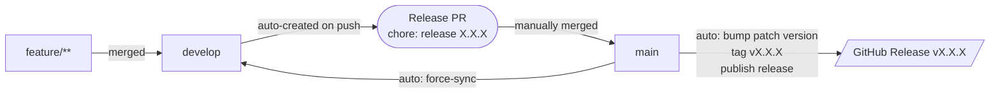

# GitHub Actions Automation Suite
This repository centralizes reusable GitHub Action workflows designed to automate your development lifecycle and enforce standard branching policies.

**Key Features:**
- **Automated Flow:** Automatically creates or updates a Pull Request from `develop` to `master` upon every merge into the `develop` branch.
- **Release Management:** On merging to `master`, the system handles **version bumping**, generates **Git tags**, and publishes a **GitHub Release** with automated release notes.

Streamline your CI/CD and keep your branches in sync effortlessly.

